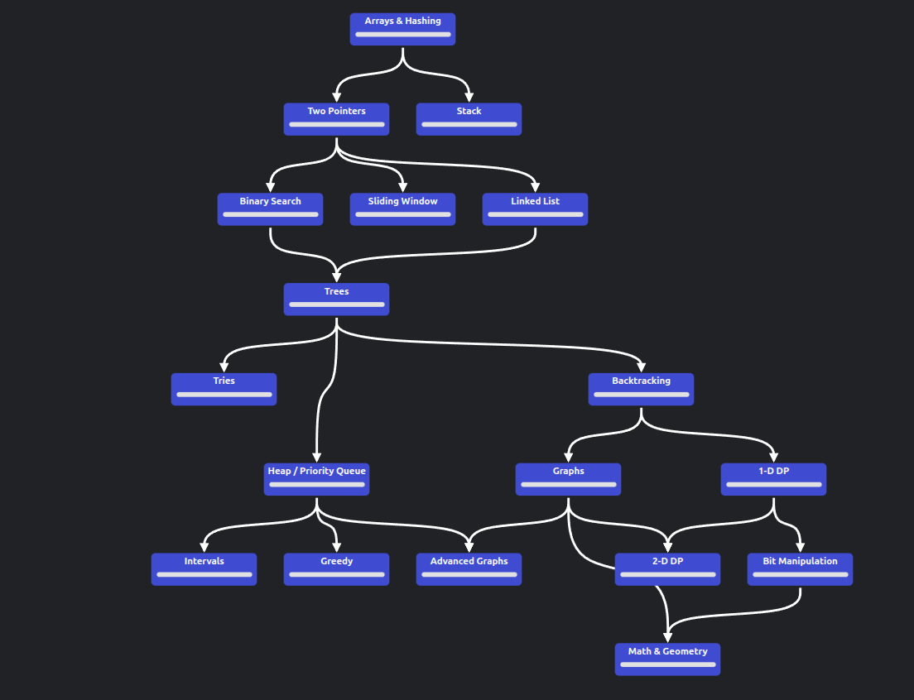
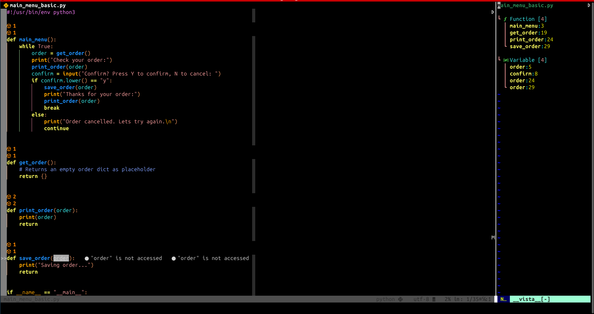
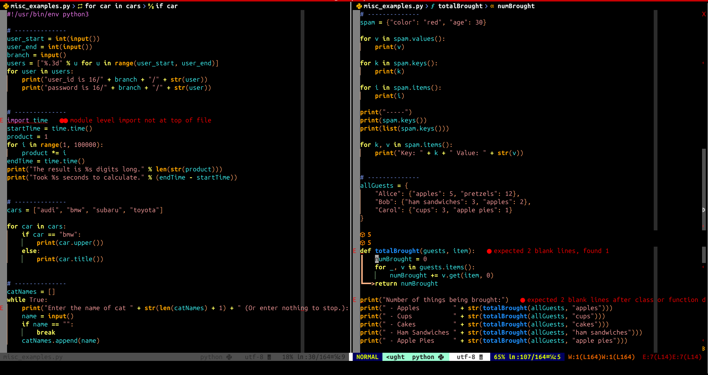

# algoritm-templates
⌁/.config/fish

 Structura

 Golang

 Python

 execute Python algorithm

 execute Python 

 execute Python Three Sum Brutforse  algorithm

 execute Go

 execute Go algorithm Three Sum

 execute Go function (education variant)

 execute Python function (education variant)

 execute Python functions 